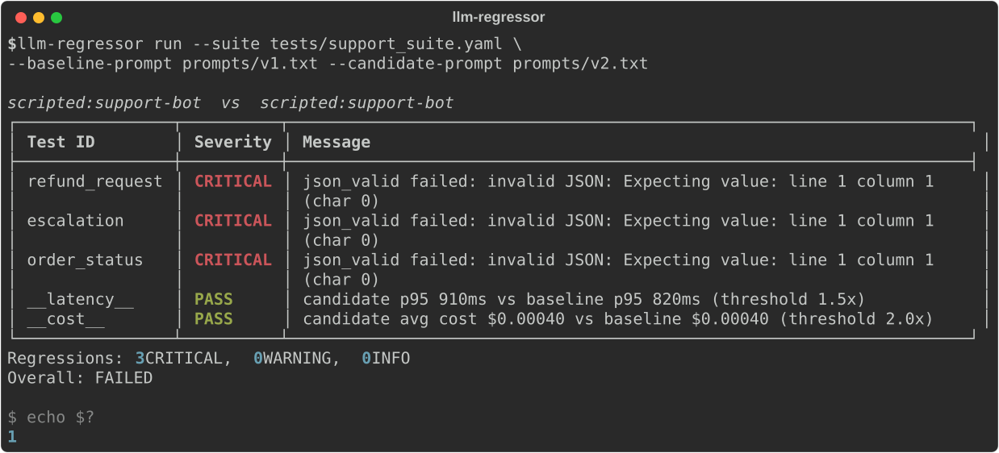

# LLM Regression Testing | Detect prompt and model regressions automatically

[](https://pypi.org/project/llm-regressor/)
[](https://github.com/siddharthgaur1/llm-regressor/actions/workflows/ci.yml)
[](#verification)
[](https://pypi.org/project/llm-regressor/)
[](LICENSE)

When you swap `gpt-4o` for `gpt-4o-mini`, edit a system prompt, or change RAG context, **llm-regressor** tells you exactly what broke: factuality, format adherence, tone, latency, cost, hallucination rate. Model-agnostic, drop-in, <10 lines to integrate.

**[Documentation](https://siddharthgaur1.github.io/llm-regressor/)** · [Quickstart](https://siddharthgaur1.github.io/llm-regressor/quickstart/) · [Worked example](https://siddharthgaur1.github.io/llm-regressor/example/) · [Check reference](https://siddharthgaur1.github.io/llm-regressor/configuration/)



<sub>Real output, not a mockup — regenerate it with `python examples/render_demo_svg.py`.</sub>

## Install

```bash
pip install llm-regressor[anthropic]   # or [openai], [litellm], [ollama], [all]
```

## Gate a pull request in five lines

```yaml
- uses: siddharthgaur1/llm-regressor@v0.1.0
  with:
    suite: tests/suite.yaml
    baseline: claude-sonnet-5
    candidate: claude-haiku-4-5-20251001
```

Posts a summary table to the PR, uploads the HTML report as an artifact, and
fails the job on a CRITICAL regression. Full input list in the
[Action docs](https://siddharthgaur1.github.io/llm-regressor/github-action/).

## Quickstart

```python
from llm_regressor import Regressor, TestSuite, providers

suite = TestSuite.from_yaml("tests/my_suite.yaml")

baseline = providers.Anthropic(model="claude-sonnet-5", system_prompt="You are a helpful assistant")
candidate = providers.Anthropic(model="claude-haiku-4-5-20251001", system_prompt="You are a helpful assistant")

reg = Regressor(baseline=baseline, candidate=candidate)
report = reg.run(suite, samples=3)

report.summary()      # rich table in the terminal
report.to_html("report.html")
report.to_json("report.json")
assert report.passed  # False if any CRITICAL regression fired
```

## Test suite format

```yaml
tests:
  - id: factual_capital
    input: "What is the capital of France?"
    checks:
      - type: contains
        value: "Paris"
    category: factual

  - id: sql_generation
    input: "Write SQL to get top 5 customers by revenue"
    checks:
      - type: format_match
        pattern: "SELECT.*FROM.*ORDER BY.*LIMIT 5"
        flags: IGNORECASE
      - type: no_injection_risk
    category: code
```

More examples in `examples/`.

## Check types

| Check | Kind | What it does |
|---|---|---|
| `contains` / `not_contains` | deterministic | substring presence/absence |
| `regex_match` / `format_match` | deterministic | structural match (SQL, code, etc.) |
| `length_range` | deterministic | response length bounds |
| `json_valid` | deterministic | response parses as JSON |
| `starts_with` / `ends_with` | deterministic | prefix/suffix match |
| `no_hallucination` | LLM judge | factual accuracy score, flags if < 0.7 |
| `tone_match` | LLM judge | tone matches professional/casual/technical |
| `instruction_following` | LLM judge | did it follow every instruction |
| `coherence` | LLM judge | logically coherent |
| `no_injection_risk` | pattern | flags dangerous SQL/code patterns |
| `semantic_similarity` | embedding | cosine similarity to a reference string |
| `self_consistency` | statistical | variance across repeated runs of the same prompt (most differentiated check — set `samples=N` on `.run()`) |
| `latency_regression` | statistical | candidate p95 vs baseline p95 |
| `cost_regression` | statistical | candidate avg cost vs baseline avg cost |

## Severity

- **CRITICAL** — a check failed outright (wrong format, missing fact, judge score below threshold) → **exit code 1**
- **WARNING** — the candidate still passes, but scored >20% below baseline, or got measurably less consistent across repeated runs → visible, non-blocking
- **INFO** — latency or cost moved → never blocking
- **PASS** — no regression

Only CRITICAL fails the build. A tool that blocks a merge every time a judge
score wobbles gets switched off within a week; the ladder exists so the
blocking signal stays worth reading.

## CLI

```bash
llm-regressor init                                    # scaffold tests/suite.yaml
llm-regressor run --suite tests/suite.yaml --baseline claude-sonnet-5 --candidate claude-haiku-4-5-20251001
llm-regressor run --suite tests/suite.yaml --baseline-prompt prompts/v1.txt --candidate-prompt prompts/v2.txt
llm-regressor report --input results.json --format html
```

Exits with code `1` on any CRITICAL regression — wire it into CI to gate merges. The [GitHub Action](https://siddharthgaur1.github.io/llm-regressor/github-action/) does this for you, with a PR comment.

## See it catch something

```bash
pip install -e .
python examples/prompt_regression_demo.py   # exits 1, no API key needed
```

A support-bot prompt gains "Be warm and personable." Replies do get warmer;
the model also quietly stops wrapping them in JSON, which the ticketing
integration downstream parses. Walkthrough:
[Worked example](https://siddharthgaur1.github.io/llm-regressor/example/).

## Architecture

`Regressor.run()` (`core/regressor.py`) calls both providers per test case,
runs each check (`checks/{deterministic,llm_judge,statistical}.py`) against
the responses, and assembles a `Report` (`core/report.py`) of per-test
`Regression`s with a severity. `Report.counts_by_category()` buckets those
by `TestCase.category` for a per-category breakdown, and `core/alerting.py`
optionally posts a Slack summary when `SLACK_WEBHOOK_URL` is set. Providers
(`providers/*.py`) all implement one `complete(prompt) -> CompletionResult`
interface, so swapping baseline/candidate models never touches check logic.

## Verification

No live-model regression numbers ship in this repo — every check requires a
real baseline/candidate model call, so there is no fixed accuracy figure to
report without an API key or a local Ollama daemon (`TODO(metric)`: run the
bundled `examples/*.yaml` suites yourself and report pass rate).

What is verified without any key, reproducibly:

```bash
pip install -e ".[dev]"
ruff check .
pytest --cov=llm_regressor --cov-report=term-missing
```

118 tests, 100% statement and branch coverage, ~2s, on Python 3.10–3.13.
The vendor SDKs are faked at `sys.modules` level, so that run also proves the
package works on a bare install with core dependencies alone. CI enforces a
90% floor; the badge above is the figure that command currently prints.

## Limitations

- LLM-judge checks (`no_hallucination`, `tone_match`, etc.) make a real LLM
  call per check per test case — cost and latency scale with suite size ×
  `samples` × 2 sides.
- `self_consistency` requires `samples > 1`, which multiplies every call by
  `samples` — expensive for large suites.
- `semantic_similarity` and `self_consistency` **silently change scoring**
  depending on whether `sentence-transformers` is installed: embeddings if
  present, `difflib` lexical similarity if not. The same suite with the same
  threshold behaves differently across those two environments. Install
  `[embeddings]` and pin it, or lower your thresholds knowingly.
- No calibration data showing how well the LLM judges agree with human
  raters — the 0.7 threshold and the 20% drop rule are defaults, not tuned
  against a labelled set. Treat WARNING as a prompt to look, not a
  measurement.
- Reported cost comes from pricing tables baked into each provider, with a
  mid-tier fallback for unrecognised models. It is an indication, not an
  invoice.
- `no_injection_risk` is a regex screen for a model that has started emitting
  destructive SQL. It is not a security control and must not gate anything
  that executes generated code.

## Providers

`providers.Anthropic`, `providers.OpenAI` (and any OpenAI-compatible endpoint via `base_url=`), `providers.Ollama` (local models), `providers.LiteLLM` (anything else). All implement `BaseProvider.complete(prompt) -> CompletionResult`.

## Development

```bash
pip install -e ".[dev,all]"
ruff check .
pytest --cov=llm_regressor
mkdocs serve            # docs at http://localhost:8000
```

MIT licensed. See [CONTRIBUTING.md](CONTRIBUTING.md).
